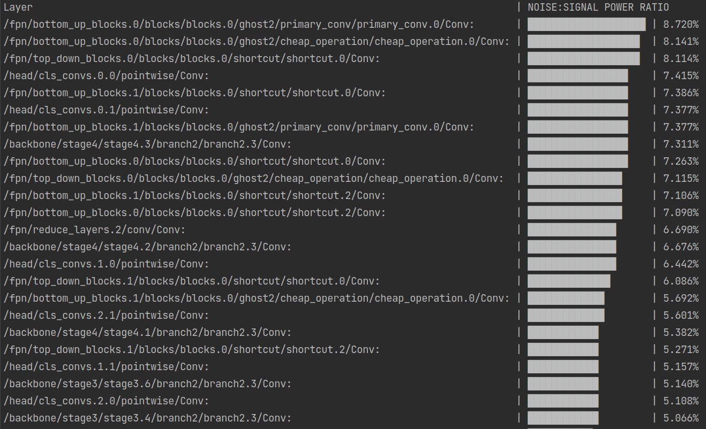
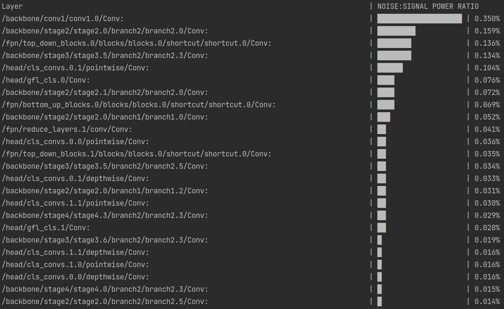
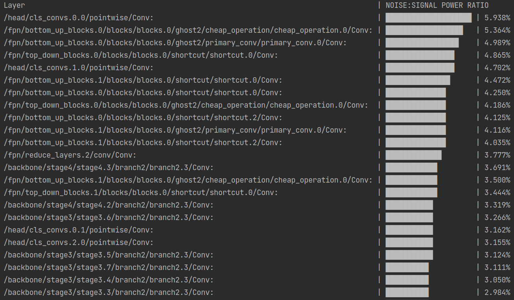
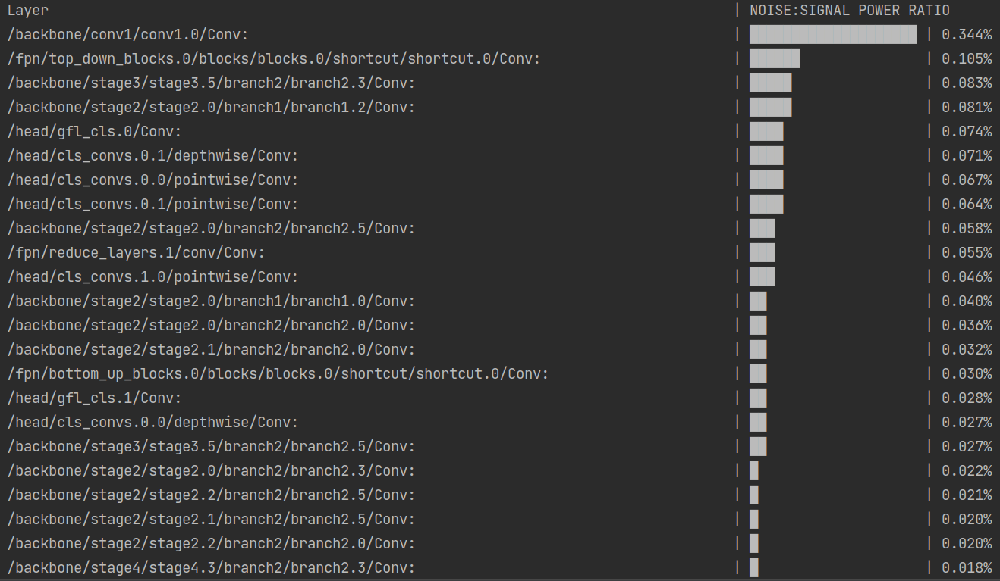
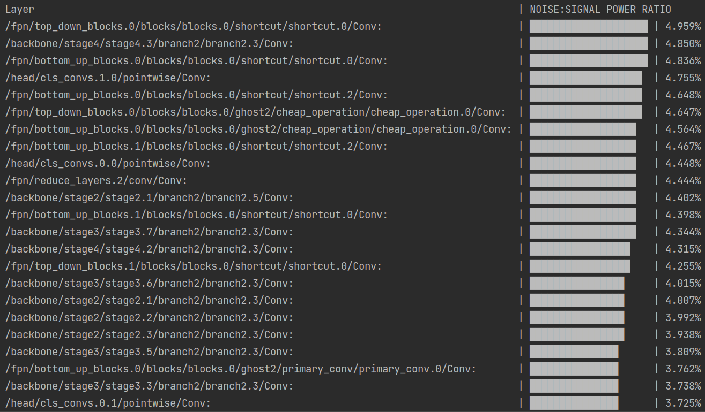
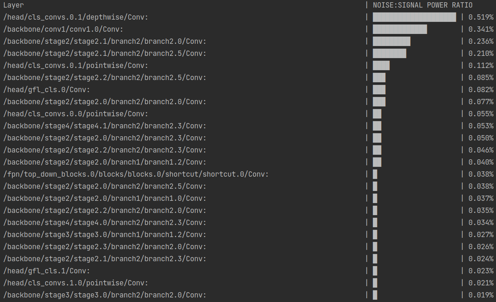

# Nanodet (Quant and Deploy based on Openvino)

官方代码仓库：

https://github.com/RangiLyu/nanodet


## 介绍

本仓库在 OpenVINO 推理框架下部署 Nanodet 检测算法，并重写预处理和后处理部分，具有超高性能！！！

让你在 Intel CPU 平台上的检测速度起飞！！！

并基于 NNCF 和 PPQ 工具将模型量化 (PTQ) 至 int8 精度，推理速度更快！！！


**优势**：方便部署，高性能。


## 推理速度

测试平台：i7-12700K

测试代码如下：

```c++
void NanoDet::benchmark(int loop_num) {
    int warm_up = 50;
    input_image_ = cv::Mat(input_height_, input_width_, CV_8UC3, cv::Scalar(1, 1, 1));
    // warmup
    for (int i = 0; i < warm_up; i++)
    {
        infer();
    }
    auto start = std::chrono::steady_clock::now();
    for (int i = 0; i < loop_num; i++)
    {
        infer();
    }
    auto end = std::chrono::steady_clock::now();
    std::chrono::duration<double> elapsed = end - start;
    double time = 1000 * elapsed.count();
    printf("Average infer time = %.2f ms\n", time / loop_num);
}
```

|         Model         | (fp32) infer latency | (nncf_int8) infer latency | (ppq_int8) infer latency |
| :-------------------: | :------------------: | :-----------------------: | :----------------------: |
|   nanodet-plus-320    |       3.12 ms        |          2.41 ms          |            -             |
|   nanodet-plus-416    |       4.80 ms        |          3.58 ms          |            -             |
| nanodet-plus-1.5x-320 |       4.70 ms        |          3.41 ms          |          3.66ms          |
| nanodet-plus-1.5x-416 |       7.59 ms        |          5.18 ms          |          5.53ms          |

**注**：1. 实际程序运行速度与图像中目标数量有关，目标越多，后处理解码和NMS耗时则越多。

​		2. ppq量化的推理速度比nncf的慢，在于两者生成的量化节点不同。


## 一、安装 OpenVINO Toolkit

参考官网安装教程 [Get Started Guides](https://docs.openvino.ai/latest/openvino_docs_install_guides_installing_openvino_apt.html)

```bash
wget https://apt.repos.intel.com/intel-gpg-keys/GPG-PUB-KEY-INTEL-SW-PRODUCTS.PUB
sudo apt-key add GPG-PUB-KEY-INTEL-SW-PRODUCTS.PUB
echo "deb https://apt.repos.intel.com/openvino/2022 focal main" | sudo tee /etc/apt/sources.list.d/intel-openvino-2022.list
sudo apt update
apt-cache search openvino
sudo apt install openvino
apt list --installed | grep openvino
```

python 安装

```bash
pip install openvino
```


## 二、模型导出与修改

1. Export ONNX model

   ```bash
   cd nanodet
   python tools/export_onnx.py --cfg_path config/nanodet-plus-m_320.yml --model_path weights/nanodet-plus-m_320.pth
   ```

2. Convert to OpenVINO

   ```bash
   mo --framework onnx --input_model nanodet.onnx
   ```

3. Add PrePostProcess

   ```bash
   python add_pre_post.py
   # 注意修改其中的模型路径
   ```


## 三、C++ demo Build and Run

#### 1  build

```bash
cd /your_path/Nanodet_openvino_quant_deploy
mkdir build && cd build
cmake .. && make -j
```

#### 2  run

```bash
cd workspace
```

图片输入：

```bash
./pro 0 "imgs/car.jpg"
```

摄像头输入：

```bash
./pro 1 0
```

视频文件输入：

```bash
./pro 2 "videos/palace.mp4"
```

benchmark：

```bash
./pro 3 0
```


## (Optional) 模型量化

#### 1  使用OpenVino量化工具NNCF（推荐）

参考官网量化教程 [Post-training Quantization with NNCF](https://docs.openvino.ai/latest/nncf_ptq_introduction.html)

1. 准备至少300张图片作为标定数据集，放入 `quant/imgs` 路径下，图片数量对应修改 `nncf_ptq.py` 文件中的 `SUBSET_SIZE` 变量值

2. 安装NNCF

   ```bash
   pip install nncf
   ```

3. 执行量化

   ```bash
   cd quant
   python nncf_ptq.py
   # 注意修改其中的模型路径
   ```

4. Add PrePostProcess

   ```python
   python add_pre_post.py
   # 注意修改其中的模型路径
   ```

注：量化的只是原模型，量化之后仍然要手动添加PrePostProcess。

#### 2  使用PPQ量化工具（不太推荐）

参考PPQ官方量化教程 [PPQ](https://github.com/openppl-public/ppq)

1. 准备至少256张图片作为标定数据集，放入 `quant/imgs` 路径下，图片数量对应修改 `ppq_ptq.py` 文件中的 `STEPS` 变量值

2. 安装PPQ

   1. Install CUDA Toolkit from [nvidia.com](https://developer.nvidia.com/cuda-toolkit-archive)

   2. Install Complier

      ```bash
      apt-get install ninja-build 
      ```

   3. Install PPQ

      ```bash
      git clone https://github.com/openppl-public/ppq.git
      cd ppq
      pip install -r requirements.txt
      python setup.py install
      ```

3. 执行量化

   ```bash
   cd quant
   python ppq_ptq.py
   # 注意修改其中的模型路径
   ```

4. Add PrePostProcess

   ```python
   python add_pre_post.py
   # 注意修改其中的模型路径
   ```

误差分析

- 1.5x-320模型：

  - 默认量化效果不算太好，整图累计量化误差和逐层量化误差分别如下图：

    

    

  - 使用Finetune之后，整图累计量化误差和逐层量化误差分别如下图：

    

    

- 1.5x-416模型：

  Finetune之后，整图累计量化误差和逐层量化误差分别如下图：

  

  

- 注：PPQ中，尝试过将最敏感的层不量化，依然保持FP32精度，但是效果并没有太好，所以并没有采用。
